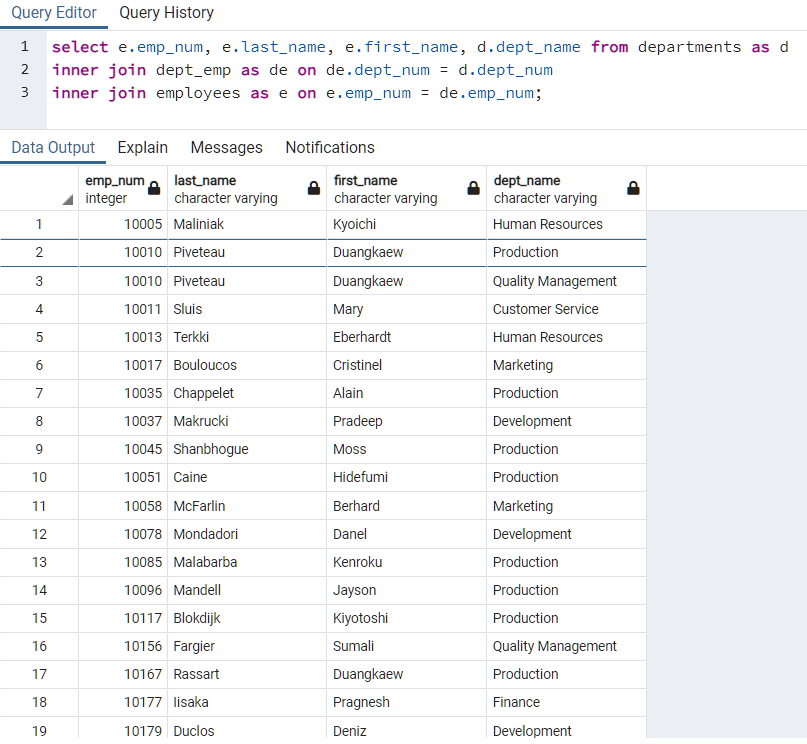
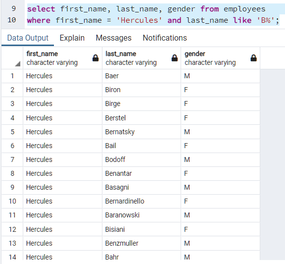
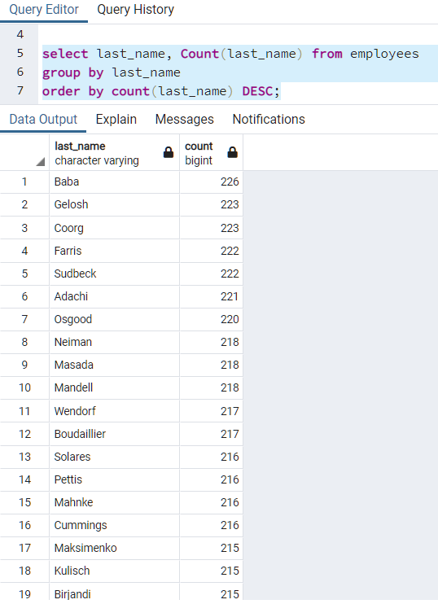

## Prompt

Create a SQL database from the provided CSVs to answers to the following questions:
1. List the following details of each employee: employee number, last name, first name, sex, and salary.

2. List first name, last name, and hire date for employees who were hired in 1986.

3. List the manager of each department with the following information: department number, department name, the manager's employee number, last name, first name.

4. List the department of each employee with the following information: employee number, last name, first name, and department name.

5. List first name, last name, and sex for employees whose first name is "Hercules" and last names begin with "B."

6. List all employees in the Sales department, including their employee number, last name, first name, and department name.

7. List all employees in the Sales and Development departments, including their employee number, last name, first name, and department name.

8. In descending order, list the frequency count of employee last names, i.e., how many employees share each last name.

## Process

## Tools
- pgAdmin
- [http://www.quickdatabasediagrams.com](http://www.quickdatabasediagrams.com)

### Entity Relationship Document (ERD)
To ensure that the six different tables are linked properly an ERD is needed. It will ensure that the primary key relationships for the SQL database will function as needed. In some cases the tables cannot be referenced directly. To solve this a junction table is used.


### SQL Database
With the schema in place the tables can be set up. For each table data types are assigned as necessary and the code generally looks like the following:
```
CREATE TABLE "employees" (
    "emp_num" INT   NOT NULL,
    "emp_title_id" VARCHAR   NOT NULL,
    "birth_date" VARCHAR   NOT NULL,
    "first_name" VARCHAR   NOT NULL,
    "last_name" VARCHAR   NOT NULL,
    "gender" VARCHAR   NOT NULL,
    "hire_date" VARCHAR   NOT NULL,
    CONSTRAINT "pk_employees" PRIMARY KEY (
        "emp_num"
     )
);
```

The quick database diagrams website makes setting up any primary or foreign key relationships easy to manage.

### Queries
Using pgAdmin queries can be ran on the dataset. For nearly all of the queries an inner join is necessary to use data from two different tables. For example:
```
-- 4. List the department of each employee with the following information: 
-- employee number, last name, first name, and department name.
select e.emp_num, e.last_name, e.first_name, d.dept_name from departments as d
inner join dept_emp as de on de.dept_num = d.dept_num
inner join employees as e on e.emp_num = de.emp_num;
```
For the inner join to work correctly the matching value from both tables needs to specified. The query shown above gives these results



#### Wildcard
In some cases, you may just want part of a string such as in the query below. A wildcard is useful for this scenario. The % after the "B" indicates in the query that we are looking for strings that start with b
```
-- 5. List first name, last name, and gender 
-- for employees whose first name is "Hercules" and last names begin with "B."
select first_name, last_name, gender from employees 
where first_name = 'Hercules' and last_name like 'B%';
```


#### Aggregation and Ordering
When using an aggregate function in SQL the important thing to remember is that it needs to be partnered with another item and that the aggregation needs to be referenced when ordering the results. In this case it is descending order.
```
-- 8. In descending order, list the frequency count of employee last names, 
-- i.e., how many employees share each last name.
select last_name, Count(last_name) from employees 
group by last_name
order by count(last_name) DESC;
```

